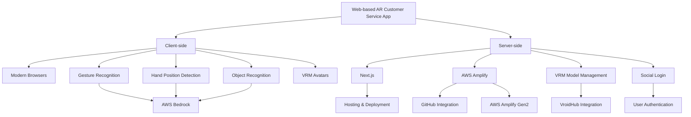

# sc4pe

```mermaid
graph TD
  A[Web-based AR Customer Service App] --> B[Client-side]
  A --> C[Server-side]
  B --> D[Modern Browsers]
  B --> E[Gesture Recognition]
  B --> F[Hand Position Detection]
  B --> G[Object Recognition]
  B --> H[VRM Avatars]
  E --> I[AWS Bedrock]
  F --> I
  G --> I
  C --> J[Next.js]
  C --> K[AWS Amplify]
  C --> L[VRM Model Management]
  C --> M[Social Login]
  K --> N[GitHub Integration]
  K --> O[AWS Amplify Gen2]
  L --> P[VroidHub Integration]
  M --> Q[User Authentication]
  J --> R[Hosting & Deployment]

```
